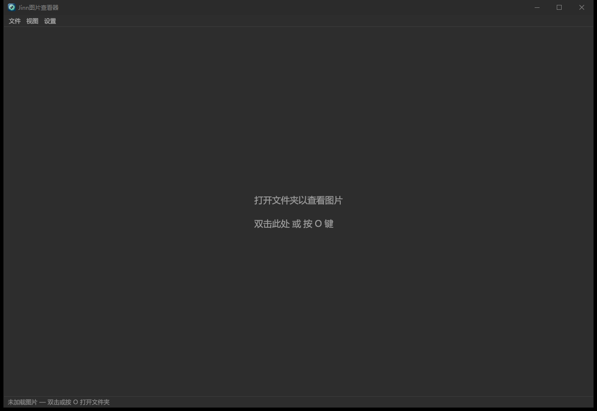
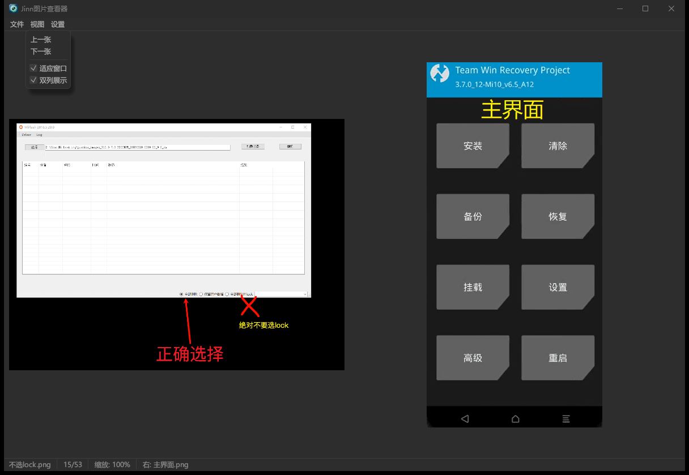
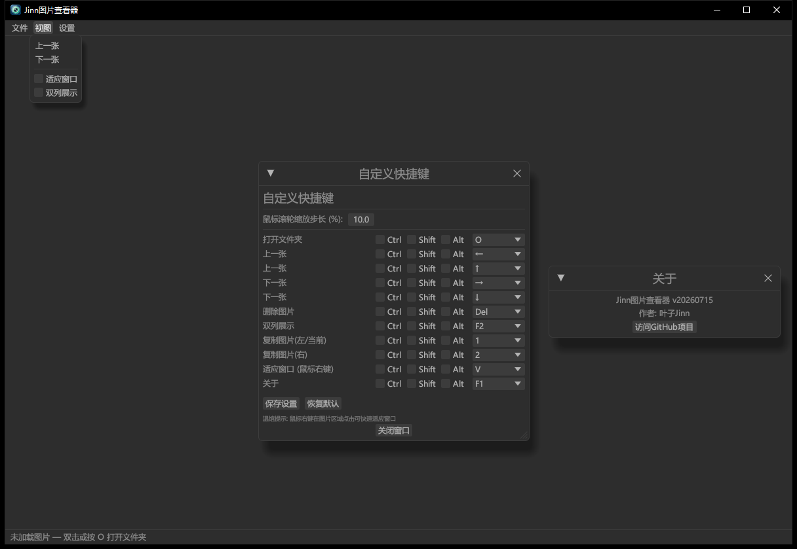

<div align="center">

# Jinn 图片查看器

**轻量、快速、暗黑主题的 Windows 桌面图片浏览器**

基于 Rust + egui 构建，启动即用，无需安装

[](https://www.rust-lang.org/)
[](https://github.com/yezijinn/jinn_imageviewer)
[](LICENSE)

</div>

---

## 截图

| 启动页面 | 双列展示 |
|:--------:|:--------:|
|  |  |

| 菜单栏 |
|:------:|
|  |

---

## 功能

- **文件夹浏览** — 打开文件夹，自动扫描 PNG/JPG/JPEG 图片，自然排序
- **键盘导航** — 方向键切换图片，循环跳转（末张→首张，首张→末张）
- **双列模式** — F2 切换左右并排对比浏览
- **鼠标滚轮缩放** — 滚轮缩放，自动退出适应窗口模式，步长可调
- **适应窗口** — V 键或鼠标右键一键适应窗口大小
- **静默删除** — Delete 键直接删除当前图片文件（无确认弹窗）
- **复制图片** — 1/2 键快速复制当前/右侧图片到 exe 同级 copy 目录
- **暗黑主题** — 全局暗黑 UI + Windows 深色标题栏
- **快捷键自定义** — 可视化面板修改任意操作的按键和修饰键
- **状态栏** — 实时显示文件名、序号、缩放比例
- **中文字体** — 自动加载 Windows 系统中文字体，无需额外配置

---

## 快捷键

| 操作 | 默认按键 |
|------|---------|
| 打开文件夹 | `O` |
| 上一张 | `←` / `↑` |
| 下一张 | `→` / `↓` |
| 删除图片 | `Delete` |
| 双列模式 | `F2` |
| 复制当前图片 | `1` |
| 复制右侧图片 | `2` |
| 适应窗口 | `V` / 鼠标右键 |
| 关于 | `F1` |
| 退出 | `Esc` |

所有快捷键均可在 **设置 → 自定义快捷键** 面板中修改。

---

## 编译

### 前提条件

- [Rust](https://rustup.rs/) (MSVC 工具链)
- [Visual Studio](https://visualstudio.microsoft.com/) 2022+ (安装 **"使用 C++ 的桌面开发"** 工作负载)

### 编译命令

```bash
cargo build --release
```

编译产物位于 `target/release/jinn-imageviewer.exe`。

### 一键编译

双击项目根目录的 `一键编译.bat`，自动检查环境、编译、复制 exe。日志输出到 `build_log.txt`。

---

## 项目结构

```
jinn_imageviewer/
├── Cargo.toml          # 项目配置和依赖
├── build.rs            # 编译脚本：嵌入 exe 图标
├── app_icon.ico        # 应用图标
├── src/
│   └── main.rs         # 全部源码
├── icons/PNG/          # 图标源文件 (16/32/48/64/128/256)
├── screenshots/        # 截图
└── 一键编译.bat         # 一键编译脚本
```

---

## 技术栈

| 依赖 | 用途 |
|------|------|
| [eframe](https://crates.io/crates/eframe) 0.31 | GUI 框架 (基于 egui) |
| [image](https://crates.io/crates/image) 0.25 | 图片解码 (PNG/JPG/BMP/GIF/WebP) |
| [rfd](https://crates.io/crates/rfd) 0.15 | 原生文件选择对话框 |
| [raw-window-handle](https://crates.io/crates/raw-window-handle) 0.6 | 获取窗口原生句柄 (暗黑标题栏) |
| [open](https://crates.io/crates/open) 5.0 | 打开外部链接 |
| [winres](https://crates.io/crates/winres) 0.1 | 编译时嵌入 Windows 图标资源 |

---

## License

[MIT](LICENSE)

---

<div align="center">

**作者：叶子Jinn**

</div>
