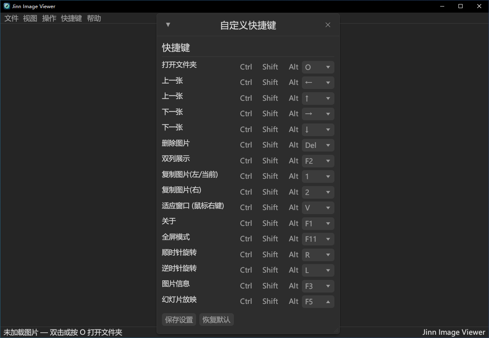

<div align="center">

# Jinn 图片查看器

**一款轻量、快速、专注本地浏览的 Windows 图片查看器**

基于 **Rust + egui/eframe** 构建，支持静态图片、GIF 动图、双列对比、缩略图导轨和多主题切换。

<p>
  <a href="#功能"></a>
  <a href="#构建"></a>
  <a href="https://www.rust-lang.org/"></a>
  <a href="LICENSE"></a>
</p>

</div>

---

## 预览

### 启动与单图浏览

<div align="center">
  
  
</div>

### 双列对比、缩略图与菜单

<div align="center">
  
  
</div>

<div align="center">
  
  
</div>

---

## 功能

### 浏览与操作

- 打开文件夹后自动扫描图片，并按自然排序排列文件名
- 支持 PNG、JPG、JPEG、BMP、GIF、WebP、TIFF、TIF
- 单列浏览与双列对比浏览
- GIF 动图播放，双列模式支持左右两侧独立播放
- 缩略图导轨根据窗口宽度分页显示
- 鼠标滚轮缩放，支持适应窗口模式
- 支持顺时针/逆时针旋转图片
- 支持复制当前图片和双列右侧图片
- 支持删除当前图片，可选删除前确认
- 支持图片信息、EXIF 信息和旋转结果保存

### 界面与配置

- 深色界面和 Windows 深色标题栏
- 黑、蓝、紫、绿、灰五种主题
- 中文 / English 界面切换
- 快捷键可视化自定义
- 最近使用目录和显示设置自动保存
- 静态画面空闲时不持续刷新，降低 CPU/GPU 占用
- 支持设置为 Windows 默认图片查看程序

---

## 快捷键

| 操作 | 默认按键 |
|---|---|
| 打开文件夹 | `O` |
| 上一张 | `←` / `↑` |
| 下一张 | `→` / `↓` |
| 删除图片 | `Delete` |
| 双列展示 | `F2` |
| 复制当前图片 | `1` |
| 复制右侧图片 | `2` |
| 适应窗口 | `V` / 鼠标右键 |
| 图片信息 | `F3` |
| 幻灯片放映 | `F5` |
| 全屏模式 | `F11` |
| 关于 | `F1` |
| 退出 | `Esc` |

所有快捷键均可在 **快捷键** 窗口中重新配置。

---

## 使用方式

### 直接运行

可以将图片文件或目录拖到程序上，也可以通过命令行传入路径：

```powershell
./target/release/jinn-imageviewer.exe "D:\Pictures"
./target/release/jinn-imageviewer.exe "D:\Pictures\photo.jpg"
```

也可以启动程序后使用菜单中的 **打开文件夹**。

### 文件关联

程序内置文件关联操作，也提供脚本：

- `register.bat`：注册为 Windows 图片查看程序
- `unregister.bat`：取消文件关联

---

## 构建

### 环境要求

- Windows 10/11
- Rust stable
- `stable-x86_64-pc-windows-msvc` 工具链
- Visual Studio 2022 或更新版本
- Visual Studio 的 **使用 C++ 的桌面开发** 工作负载

检查工具链：

```powershell
rustup default stable-x86_64-pc-windows-msvc
rustc --version
cargo --version
```

### Release 构建

```powershell
cargo build --release
```

生成文件：

```text
target/release/jinn-imageviewer.exe
```

也可以运行项目提供的构建脚本：

```powershell
./build.ps1
```

或双击：

```text
build_exe.bat
```

### 验证

```powershell
cargo fmt --all -- --check
cargo check --all-targets --all-features
cargo clippy --all-targets --all-features -- -D warnings
cargo test --all-targets --all-features
```

---

## 项目结构

```text
jinn_imageviewer/
├── src/
│   ├── main.rs       # Windows 程序入口
│   ├── app.rs        # 应用状态、快捷键和生命周期
│   ├── ui.rs         # 菜单、图片区域、缩略图和窗口 UI
│   ├── image.rs      # 图片扫描、解码、纹理和 GIF 管理
│   ├── config.rs     # 配置读写
│   ├── i18n.rs       # 中英文文本
│   ├── shortcuts.rs  # 快捷键配置
│   ├── sorting.rs    # 自然排序
│   ├── theme.rs      # 主题和颜色
│   └── lib.rs        # 模块导出
├── tests/            # 集成测试
├── screenshots/      # README 截图
├── icons/            # 图标源文件
├── app_icon.ico      # Windows 应用图标
├── build.rs          # 编译资源和版本日期
├── Cargo.toml        # Rust 项目配置
└── Cargo.lock        # 依赖锁定文件
```

---

## 技术栈

| 组件 | 用途 |
|---|---|
| [eframe](https://crates.io/crates/eframe) | 原生窗口和 egui 应用框架 |
| [egui](https://github.com/emilk/egui) | 即时模式 GUI |
| [image](https://crates.io/crates/image) | 图片解码和 GIF 帧处理 |
| [rfd](https://crates.io/crates/rfd) | Windows 原生文件夹选择框 |
| [raw-window-handle](https://crates.io/crates/raw-window-handle) | 获取原生窗口句柄 |
| [serde](https://crates.io/crates/serde) | 配置序列化 |
| [winres](https://crates.io/crates/winres) | Windows 图标资源嵌入 |

---

## 许可证

本项目采用 [MIT License](LICENSE)。

<div align="center">

**作者：叶子 Jinn**

</div>
